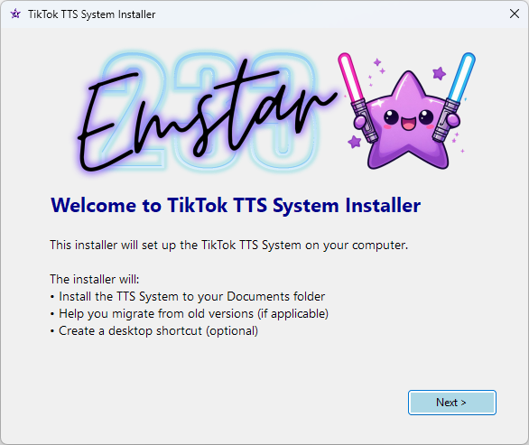

Note the BSR injector is no longer bundled with this system.  
Get it from here: https://github.com/Panther-Dust22/TikTok-Beatsaber-bsr-Injector  


```

✨⭐✨⭐✨⭐✨⭐✨⭐✨⭐✨⭐✨⭐✨⭐✨⭐✨⭐✨
     ✨         TTS Voice System V5              ✨
     ✨                OVERHAUL                  ✨
     ✨       ___ __  __    ___ ________         ✨
     ✨      | __|  \/  |/\|_  )__ /__ /         ✨
     ✨      | |_| |\/| >  </ / | \|_ \         ✨
     ✨      |___|_|  |_|\//___|___/___/         ✨
     ✨💫 Created by Emstar233 & Husband (V5) 💫✨
✨⭐✨⭐✨⭐✨⭐✨⭐✨⭐✨⭐✨⭐✨⭐✨⭐✨⭐✨

```  

Thanks for downloading the new overhauled version of our TTS.  
We have tried to make this as user-friendly as possible,  
but there may still be glitches and bugs, feel free to report these.  

You can discuss this programme and its features or code on our Discord.  

https://discord.gg/PVvv8M5e83

We are always active and ready to help you with any issues.

         

.....The TTS BSR Injector V5 Overhaul edition....

Installation instructions.

Run the install file, it may ask you to install .net Desktop 8.x, this is direct from Microsoft and is safe.  
You may have to try and run the install again and should be greeted by this install screen



After you click next, there are a few options:

     New User - Decide if you want a shortcut and just press next and next again, all files will be created for you.  
     Old user - any of my previous TTS versions  
     Create shortcut (you don't have to have this if you don't want it)  


If you are a previous user of any of our old TTS apps you will be greeted with a screen with a browse button  

     Click Browse and locate your old Data folder from wherever you kept TTS and select just 1 file, it will capture them all for you.  
     If you used txt files it will convert them for you and place them in the correct folder  
     if you are a json user it will move your old settings to the new folder


Once finished, you can launch the TTS app or close the installer, a shortcut will be on your desktop if you selected it  


In the GUI are all the buttons, bells and whistles (voices) that you could need. and more, in the top right of the window is a themes button, enjoy :)  
The left side gives you a command window, an idea of what is going on in the program.  
on the right side at the top you have the health status of each module of the system, red means not active or error and green is online and working  

1st row row of buttons.

Start/Stop    : will be green when TTS is running and Red when stopped  
!tts command  : Enables or disables the need for viewers to use the !tts code to speak  
Mod Commands  : Enables or disables the abilities for moderators to control your TTS NEW COMMANDS ADDED, SEE END OF README!  
Specials      : A control panel for default tts speed, default voices for mods, subs followers, etc  
Edit bad reply: Brings up a panel to add or remove filter words and replies  
Emergency stop: Turn on or off the Mod command to stop tts and reset it if someone is being a prick  

 BSR INJECTOR REMOVED AS ITS NOW STANDALONE  get it here https://github.com/Panther-Dust22/TikTok-Beatsaber-bsr-Injector

2nd row is active user control, active users in the last 10 mins are captured and added to this list for voice control

Active user       : Select the user to adjust  
Voices            : Select a voice available from the list for this user  
Name Swap         : change a user's spoken name (great if they have a long name or use emojis leave empty for no name swap)  
Speed             : Change the spoken speed of this one user (none will use set default speed)  
Apply (button)    : Apply the above changes  
Remove (button)   : Removes the above properties for selected user  
Edit List (button): Shows your entire priority voice list where you can edit and delete users off even if not online  


3rd row is volume  

Volume slider     : Do i have to explain this one?

4th row is system info updates and test API

Msg queue, Audio Queue, Active users - these are self-explanatory. If msg queue or audio queue start to show anything other than 0 then there is an error  
Active users just shows the total amount of users talking in your Live session.  
Updates button    : will flash red if there is an update available on Github for you  
Test API          : Will check the API is working for voices, mostly just use to diagnose issues

5th row is my information panel, shows next planned update and live information on any bugs found and also gives a link to our discord


Updates: NO MORE PYTHON! this system is built using c#, its faster, better, stronger and works harder without eating into CPU resources, it has its own installer to guide you through the full setup.  
i have added a couple new things over the previous version including user count, information panel and themes

Mod commands for stream if enabled, give this list to your mods or add to your Discord.

| Command                  | Format                          | Description                                                     | Example                        |
| ------------------------ | ------------------------------- | --------------------------------------------------------------- | ------------------------------ |
| \*\*Add Voice Mapping\*\*    | `!vadd <name> VOICE \[speed]`    | Assign a specific TTS voice (and optional speed) to a username. | `!vadd John Smith STITCH 1.2`   |
| \*\*Remove Voice Mapping\*\* | `!vremove <name>`               | Remove a stored voice mapping for the user.                     | `!vremove John Smith`          |
| \*\*Change Voice Mapping\*\* | `!vchange <name> VOICE \[speed]` | Update an existing mapping to a new voice (and optional speed). | `!vchange John Smith DEADPOOL 1.5`  |
| \*\*Add Name Swap\*\*        | `!vname <original> - <new>`     | Change how a user’s name is spoken in TTS.                      | `!vname John Smith - The King` |
| \*\*Remove Name Swap\*\*     | `!vnoname <name>`               | Remove a spoken name override.                                  | `!vnoname John Smith`          |
| \*\*Add Rude Words\*\*       | `!vrude <word1> <word2> ...`    | Add words to the rude-word filter. Avoids duplicates.           | `!vrude foo bar baz`           |
| \*\*Emergency shut down\*\*  | `!restart`                      | If enabled in the GUI stops and restarts TTS (clears queue).    | `!restart          `           |
